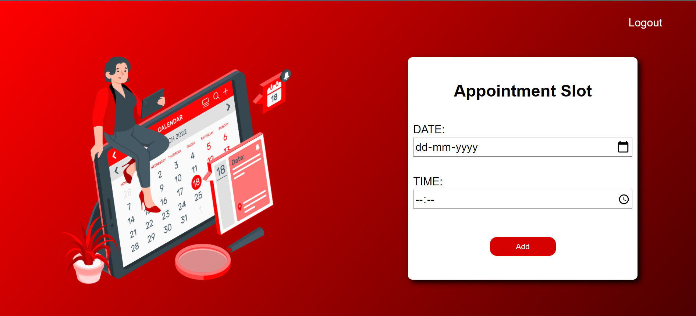
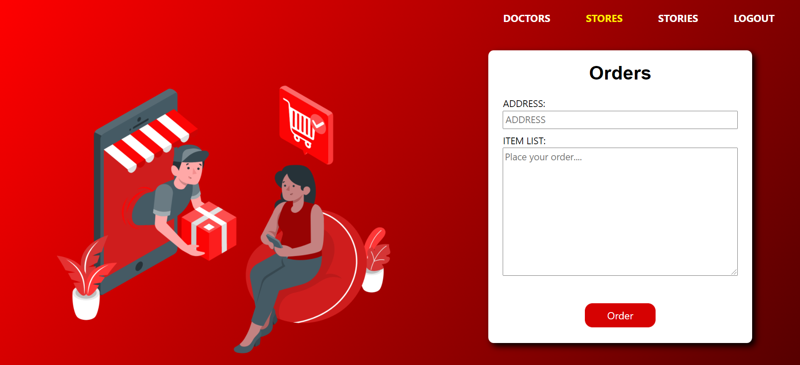
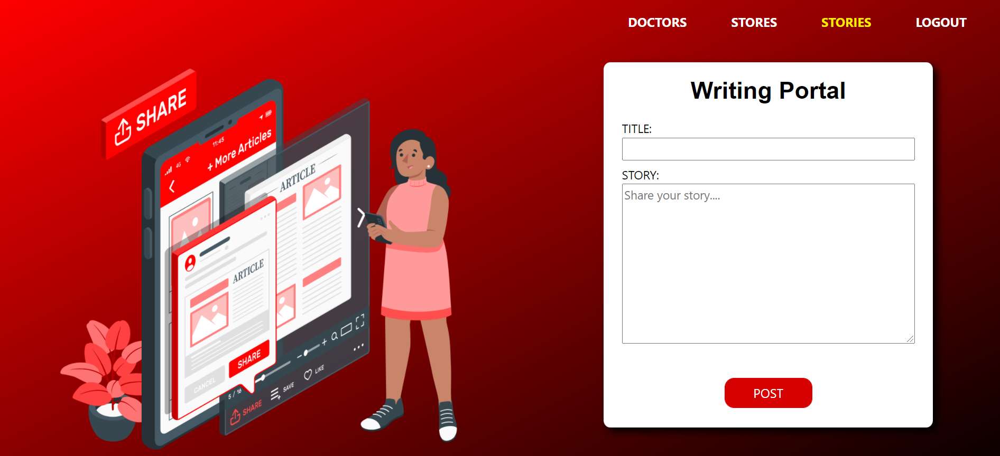
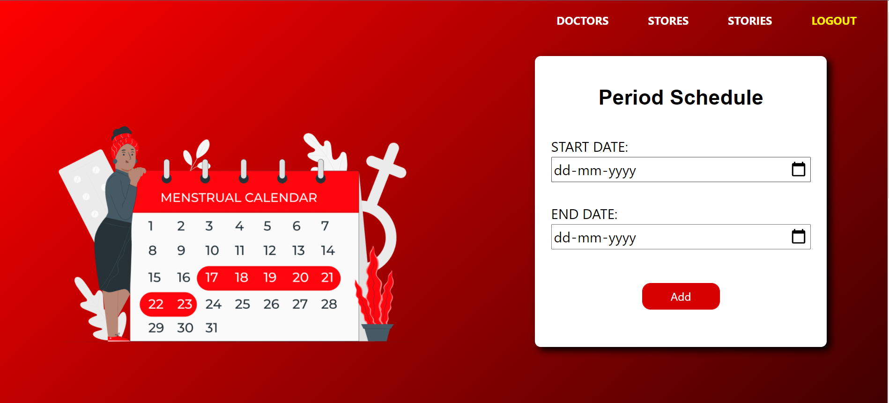

# Mission Red

## Problem Statement :
Menstruation or periods are the normal and healthy part of life of women. But, lack of availability of sanitary products and hygienic infrastructure exacerbate the problem for women during their menstrual cycle leaving them in helpless and isolated state. Also, entrenched stigma and taboos related to menstruation worsen the situation for women. Hence, drastic changes are needed to encourage positive social norms and ultimately enact behavioural change towards menstruation process.

## Introduction :
Mission Red is a web portal that aims to create awareness about menstruation and provide solutions to the general problems faced by women during this phase. It provides doctor's consultation support, delivery service by stores selling sanitary products, periods tracker and blog writing section to publicly discuss about menstruation.

## Idea Effectiveness :
According to National Family Health Survey 2015-2016 out of the 336 million menstruating women in India only about 121 million (roughly 36 percent) women use sanitary napkins. As per report by the NGO Dasra, almost 23 million girls in India drop out of school annually, because of lack of menstrual hygiene management facilities, including availability of sanitary napkins and awareness about menstruation. Also, only 50% of the girls are aware about mensturation process before enter they enter in this phase. So, significant steps are needed to create awareness about menstruation process and reduce period poverty.

## Features :
### Doctor's Consultation Support:
General practitioner, gynecologist or any other doctors can register on the portal and can educate people about this natural process and provide consultation and solution to the problems faced by women such as hormonal changes, weakness, etc during this painful phase.   
*Only verified doctors will be able to schedule appointments with the users to prevent the spread of misleading information.*

### Sanitary Products Delivery:
Pharmacist or store owners having sanitary products can register on the portal and can contribute their bit in this mission by delivering the essential sanitary products to the current location of the user be it home, office or any other place.

### Blog Section:
Users can create awareness about menstruation by voicing out their views on the topic on a public platform. They can write blogs, stories or any other experience that can create an impact on the society. Also, they can read the blogs written by other users.

### Period Schedule Tracker:
Women can track their menstrual cycle by storing the duration of their periods in this tracker. It will help them to identify whether they are having regular or irregular periods. They can also share these details while consulting a doctor for any period related problem and this will help the doctor to understand the situation better.

## Tech Stack :
- HTML
- CSS
- Bootstrap
- Django
- SQLite

## Setup Instructions :
1. Clone the repository  
`git clone https://github.com/Anjali2001saxena/MissionRed.git`
2. Change the current working directory  
`cd MissionRed`
3. Activate the virual environment  
`venv\Scripts\activate`
4. Install the requirements  
`pip install -r requirements.txt`
5. Run django project  
`python manage.py`

## Links :
- **Project Link :** https://missionred.herokuapp.com/
- **Presentation Link :** https://1drv.ms/p/s!Ams4_xtTIau_hYUCyTzHFT3Kbknr2A?e=QX53Xf
